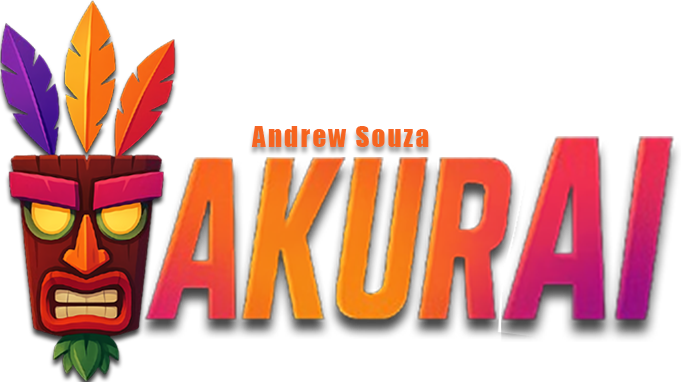

  

## 🚀 Technologies
This project was developed using the following technologies:
- HTML
- CSS
- JavaScript
- Gemini 2.5 flash
## 💻 Project
[AkurAI](https://drewgdev.github.io/akurai-game-assistant/) is an AI-powered eSports assistant offering strategies and tips for games like Dead by Daylight, League of Legends, Terraria (including the Calamity mod), and Valorant. Developed by me using learnings from Rocketseat's NLW20.
## 🧐 Usage Instructions:
- Enter your Gemini 2.5 flash API key
- Select the game of your choice
- Ask your question and receive your answer :)
#### Contact me

